

# Zoron Theme

A theme for [Calagopus Panel](https://calagopus.com): an icon rail with your servers and folders, a full height
console workspace, a server page of its own, and **Zoron Studio**, a live theme editor.

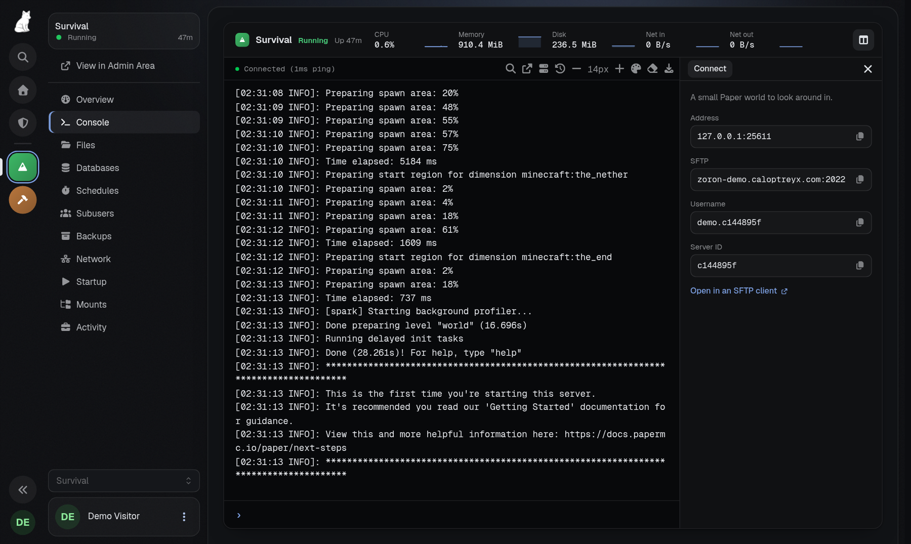

**[Try the demo](https://zoron-demo.caloptreyx.com)** · sign in as `demo` / `zorondemo`

## Features

- **Rail**: core's sidebar becomes an icon rail (Home, Admin, your server groups as Discord style folders, your other
  servers) beside a collapsible context panel. Drag a server onto another to make a folder, into a folder to add it,
  out to remove it; drag folders to reorder them. Right click a folder to rename or ungroup it. On a phone the rail
  and panel open from a top bar.
- **Server tiles**: everyone can give a server their own tile, an icon (44 to pick from, or initials), a colour and
  a name only they see, from the rail tile's or the server card's menu or the server page header. It follows their
  account to every device and shows on the rail, the servers page, the server page and the console.
- **Servers page**: search, status and group filters, sorting, and cards with status, uptime, a copyable address
  and power controls; select several for bulk power actions. Can be switched back to the panel's own list.
- **Server page**: a server opens on its status, live CPU, memory, disk and network, recent activity, how to
  connect (address, SFTP, ID) and its backups, schedules and addresses at a glance; the console is the next link.
  Studio picks the blocks and their order, the layout, bars, live graphs or plain figures for usage, how much
  activity, a plain or banner header and the description, or switches it off.
- **Console**: one full height workspace: a command bar with the server's state and live figures with sparklines,
  the terminal with a prompt line, quick command chips, and an inspector with the connect details, the commands and
  other extensions' cards (docked, sliding in, or a sheet on a phone). Clear the console or download its log from
  the terminal's header.
  - In Studio: which figures show and their graph style (area, line, bars or none), the inspector on the right, the
    left or off and whether it starts open, spacing, quick commands on or off, and commands for everyone.
  - **Terminal looks**: 18 colour schemes (the theme's own, the panel's, One Dark, Dracula, Nord, Gruvbox, Tokyo
    Night, Catppuccin, Solarized and GitHub in dark and light, Monokai, Rosé Pine, Everforest, Kanagawa, and green
    and amber phosphor screens) and six frames (card, window, flush, glass, CRT, neon), line height, and tinted
    error and warning lines. Admins set the site's look and can let every user pick their own from the terminal
    header.
- **Sign in page links**: up to four chips above the logo on the sign in pages, such as a demo login, your docs or
  your Discord.
- **Nine presets**: four minimal looks (Carbon, the default, Graphite, Mono, Sandstone) and five glass ones (Aurora,
  Nebula, Lagoon, Verdant, Ember), plus a palette generator and presets of your own.
- **Colours**: two accents (the gradient), background, surface and text drive every shade; optional status
  colours and light mode overrides. A contrast check flags pairs below WCAG AA.
- **Backdrop and surfaces**: aurora, spotlight, mesh or solid backdrops with a grid, dot or grain texture, or your
  own image; glass, solid or outline cards with blur, edges, shadows and corner radii.
- **Layout and type**: the rail or core's sidebar (floating or docked), current link and button styles, glow,
  density and interface size; Geist, Inter, Plus Jakarta Sans, Space Grotesk, Outfit, system or the panel's font,
  heading weight, gradient titles, Geist Mono or JetBrains Mono for code.
- **Motion**: full, subtle or none (reduced motion is always respected); rise, fade or zoom page transitions;
  hover lift on clickable cards; a greeting above the servers list.
- **Studio**: live preview of any page (servers, a server, the console, account, admin, login) at desktop, tablet
  or phone width, in dark or light mode; a settings search; hold to compare with the saved theme; per tab changes
  and reset; undo and redo; import and export as JSON; Ctrl/⌘+S to save; a warning when someone else saved since
  you opened it.

Open Studio from **Admin → Zoron Studio** or the extension's card on **Admin → Extensions**. Saving needs
`settings.update` or the extension's own `zoron-theme.update` admin permission.

## Screenshots

| Servers | Server page |
| --- | --- |
| 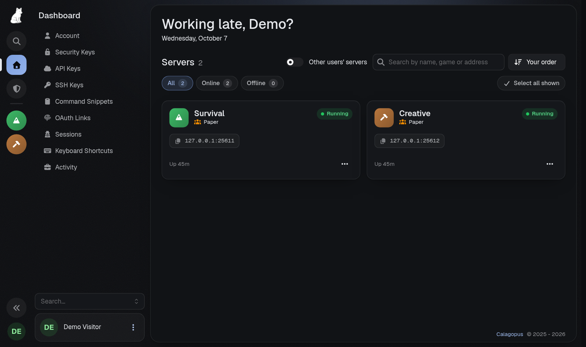 | 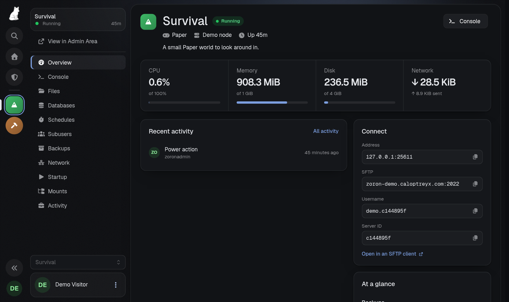 |

| Window frame, Catppuccin | CRT frame, phosphor |
| --- | --- |
| 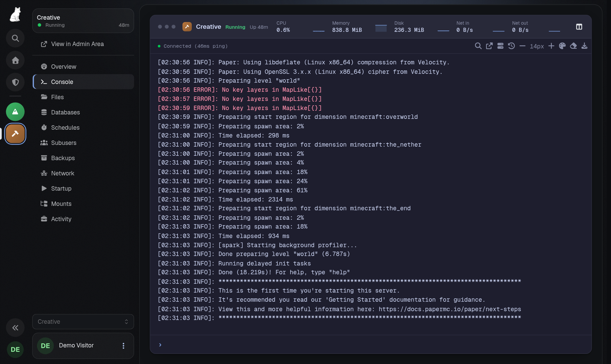 | 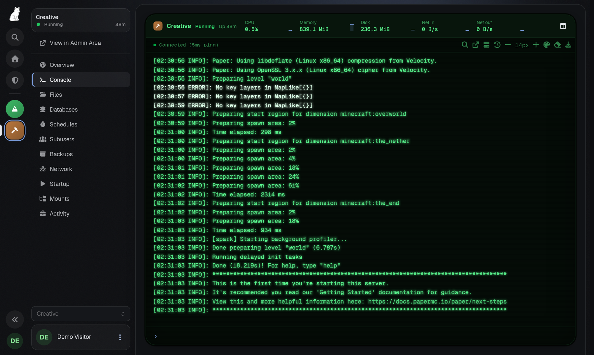 |

| Zoron Studio | Studio's console settings |
| --- | --- |
| 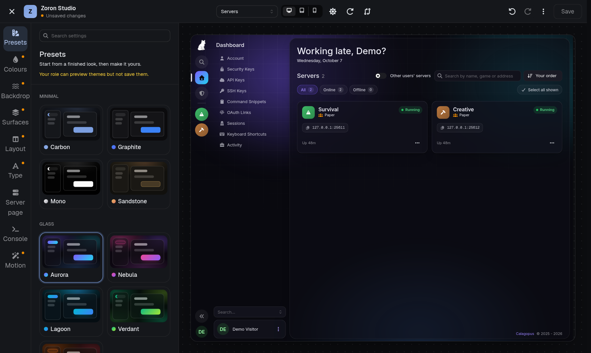 | 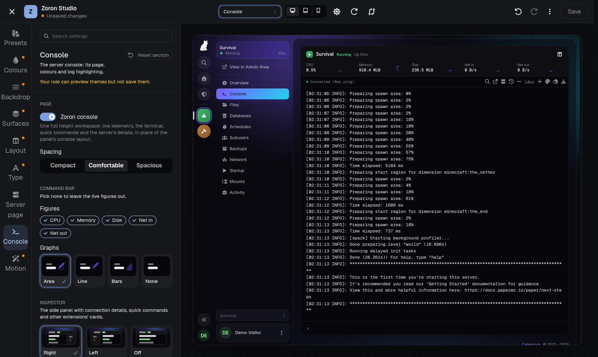 |

| Server tiles | Sign in page |
| --- | --- |
| 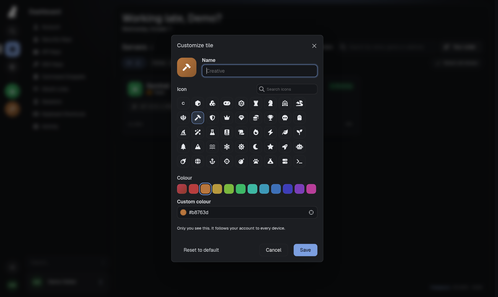 | 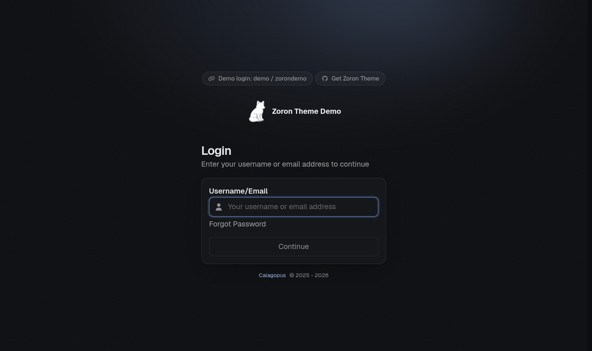 |

  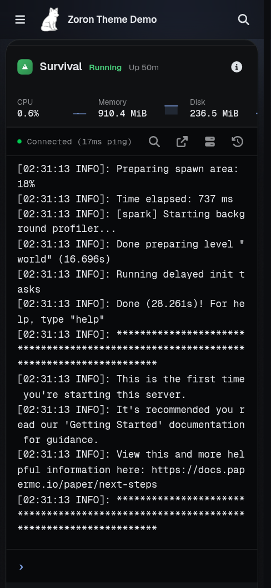
  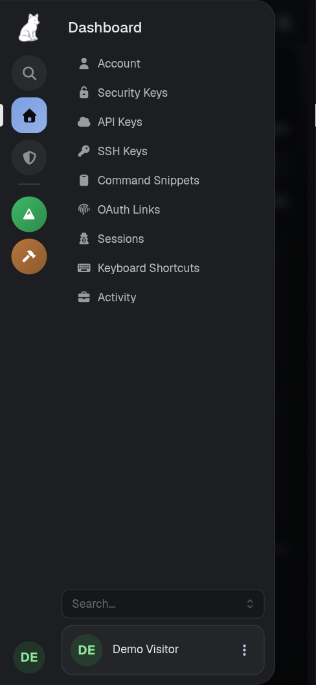

## Demo

https://zoron-demo.caloptreyx.com: sign in as `demo` with the password `zorondemo`. It has two Paper servers to try
the rail, folders, server tiles, the console and the server page on, and Zoron Studio to look through. Saving is
turned off there, and the demo resets every hour.

## Install

> [!NOTE]
> Requires Calagopus Panel **1.2.0** or newer.

1. Download `dev_caloptreyx_zoron.c7s.zip` from the [latest release](https://github.com/Caloptreyx/Zoron-Theme/releases/latest).
2. In the panel, open **Admin → Extensions** and install the file.
3. Restart the panel.

The extension is listed as **Zoron Theme** (`dev.caloptreyx.zoron`). To build the zip yourself, run
`python3 scripts/package.py`.

## Licence

MIT. The bundled fonts are under the SIL Open Font License, with their licence texts in `frontend/src/fonts`.
